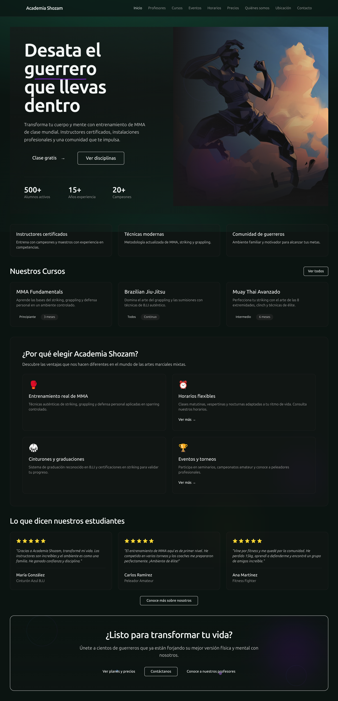

# Academia Shozam — Landing Page

Landing page para **Academia Shozam**, academia de artes marciales mixtas (MMA). Diseño oscuro con acento verde, totalmente responsive y con animaciones de navegación suaves.



---

## Páginas

| Ruta | Descripción |
|---|---|
| `/` | Inicio — Hero, estadísticas, llamado a la acción |
| `/courses` | Cursos disponibles |
| `/teachers` | Equipo de instructores |
| `/schedule` | Horarios de clases |
| `/events` | Próximos eventos y torneos |
| `/pricing` | Planes y precios |
| `/about` | Quiénes somos |
| `/location` | Ubicación e información de contacto |
| `/contact` | Formulario de contacto |

## Tech Stack

- **React 19** + **TypeScript**
- **Tailwind CSS v4**
- **React Router v7**
- **Radix UI** (componentes accesibles)
- **Lucide React** (iconos)
- **Rspack** (bundler)

## Instalación

```bash
# Clonar el repositorio
git clone <repo-url>
cd Landing_Page_Academia_Shozam

# Instalar dependencias
pnpm install

# Correr en desarrollo
pnpm dev
```

## Scripts

```bash
pnpm dev      # Servidor de desarrollo (http://localhost:8080)
pnpm build    # Build de producción
pnpm preview  # Preview del build
pnpm lint     # Lint con ESLint
pnpm format   # Formatear con Prettier
```

## Requisitos

- Node.js ≥ 20
- pnpm

## Estructura

```
src/
├── assets/          # Imágenes y recursos
├── components/
│   └── ui/          # Componentes reutilizables (Button, Sheet…)
├── hooks/           # Custom hooks
├── lib/             # Utilidades
├── pages/           # Páginas de la app
├── App.tsx
├── main.tsx
└── index.css        # Estilos globales + Tailwind
```
